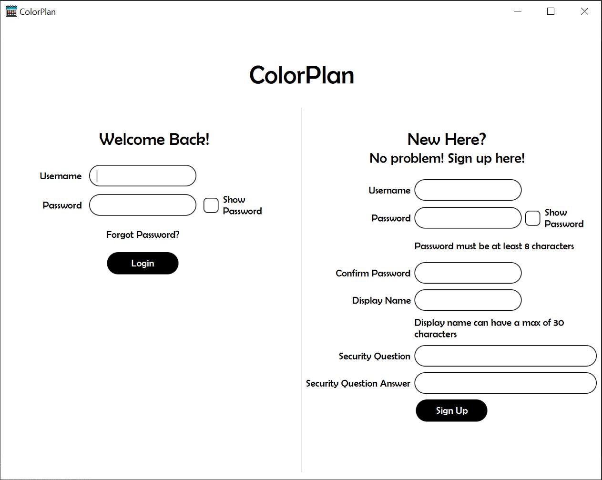
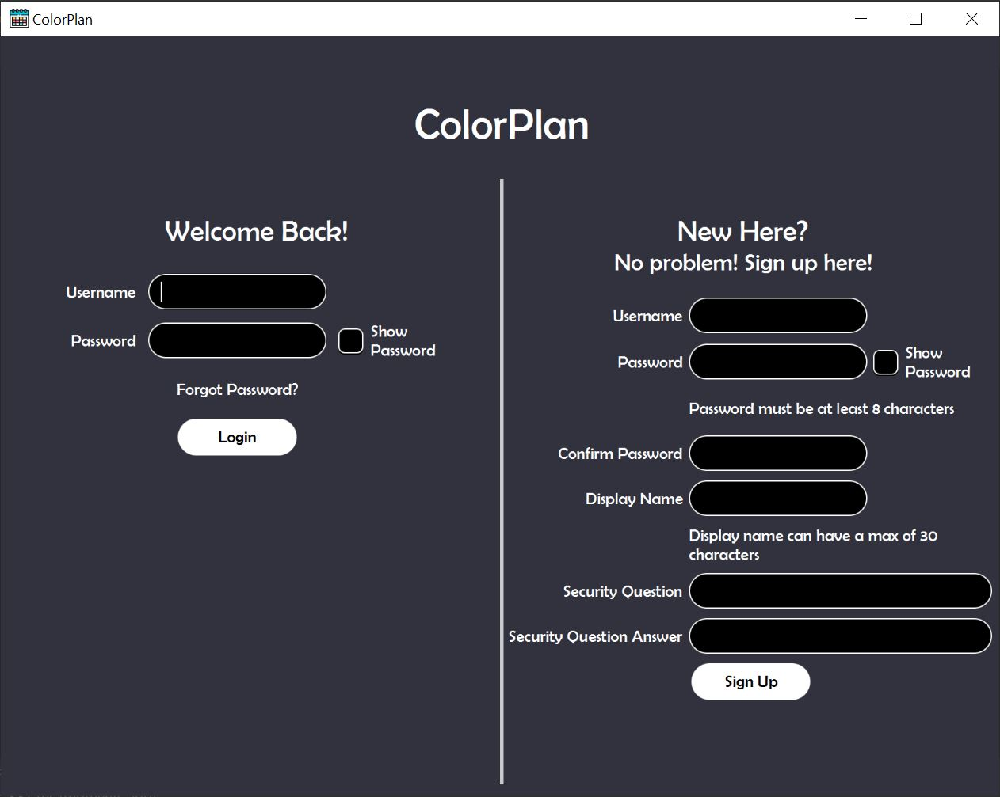

# Masters Project - ColorPlan

## Waewarin Chindarassami

### This is a repository for the project that is one of the options for the masters degree.
### This project is now complete

## Calendar Program
ColorPlan is a basic calendar program. The user is able to add events to the calendar and assign categories to those events. The events displayed on the calendar are color coded based on the category.

Below are the main pages and are displayed on the bottom navigation of every view
* Home
  * A quick overview of the week ahead starting from the current date
  * Add, edit, and delete events for those seven days
  * Logout
* Calendar
  * Monthly view
  * Go to a specific date
  * Simply click on a date to view its events
  * Add, edit, and delete events
* Add Event
* Categories
* Settings

***Note:*** There may not be daily and yearly views as that is difficult to do and for simplicity of the program

### Acknowledgements
The calendar icon on the title bar: https://www.flaticon.com/free-icon/schedule_3269691?term=calendar&page=5&position=55&origin=search&related_id=3269691

Google material design for navigation icons: https://fonts.google.com/icons?icon.style=Rounded&icon.set=Material+Icons

### Screenshots

</img>
</img>
